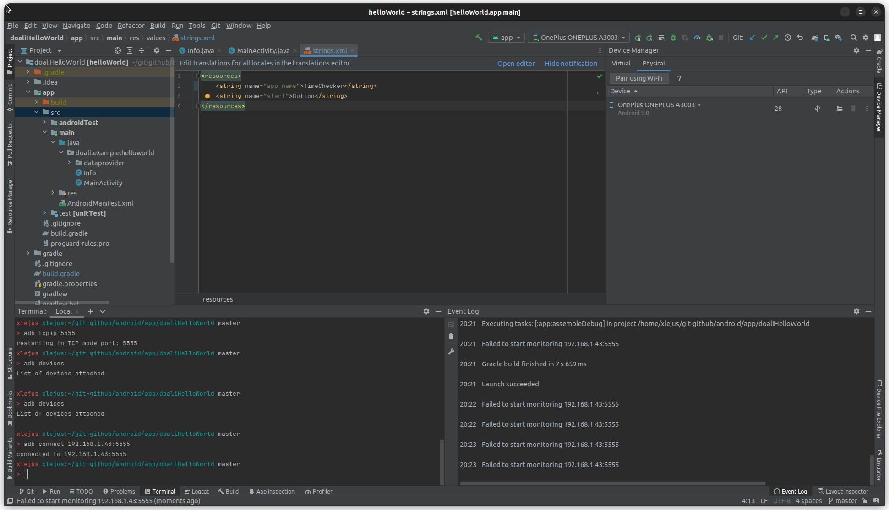

# `adb` && `scrcpy` && `android-studio`

## `adb` 

_Android Debug Bridge_

### Installation

```bash
sudo apt install adb
```

### `adb shell <command_remote>`

> Enable to run a command on the connected device

```bash
xlejus xlejus:~/git-github/android master 
> adb shell uname -a
Linux localhost 3.18.120-perf+ #1 SMP PREEMPT Mon Nov 4 21:23:10 CST 2019 aarch64
xlejus xlejus:~/git-github/android master 
> uname -a
Linux xlejus 5.19.0-35-generic #36~22.04.1-Ubuntu SMP PREEMPT_DYNAMIC Fri Feb 17 15:17:25 UTC 2 x86_64 x86_64 x86_64 GNU/Linux
xlejus xlejus:~/git-github/android master 
> 
```

> As an instance `adb shell uname -a` returns the information which belongs to the connected device.

### Settings

*tcpip*


*Do not forget to*


## `scrcpy`

### Installation

```bash
snap install scrcpy
```

### Settings


## `android-studio`



```bash
adb kill-server # to be sure...
adb start-server # 5037 is the default port
adb devices # here we can see the id (and check it via `dmesg` command)
adb tcpip 5555
```

> unplug cable

```bash
adb connect 192.168.1.43:5555
```

> From android-studio `run` and see that the application is built and running on the smartphone (thanks to TPC/IP settings)

## Biblio

- [scrcpy git](https://github.com/Genymobile/scrcpy)
- [scrcpy wiki ubuntu](http://doc.ubuntu-fr.org/scrcpy)
- [rooting android](https://www.hexnode.com/mobile-device-management/help/rooting-in-android-devices/)
