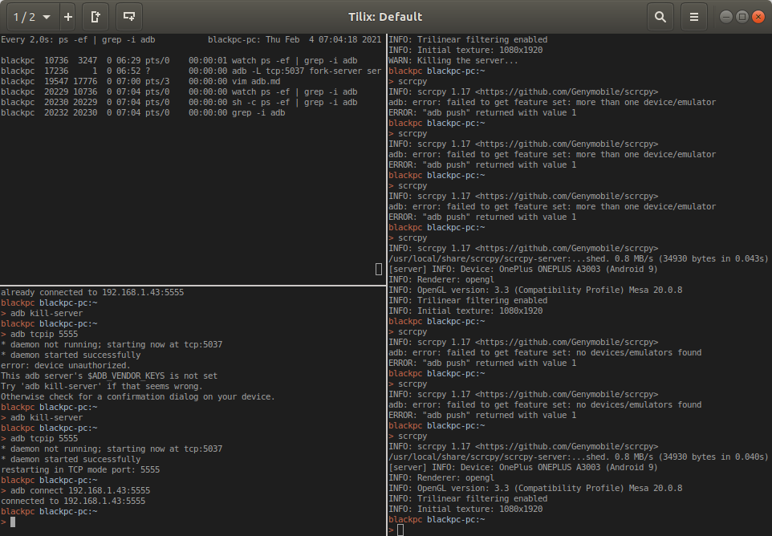
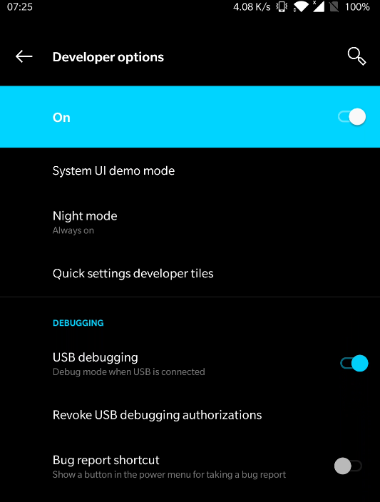
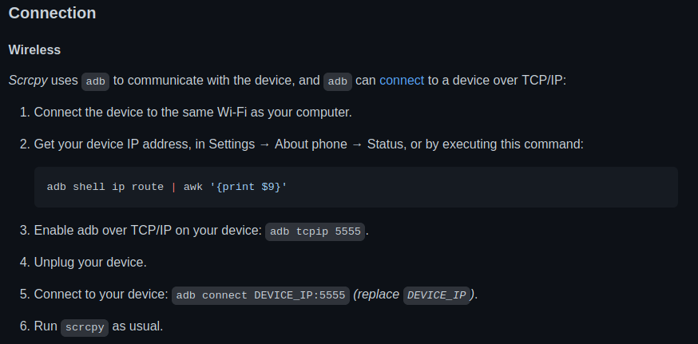

# `adb` && `scrcpy`

## `adb` 

_Android Debug Bridge_

### Installation

```bash
sudo apt install adb
```

### Settings

*tcpip*



*Do not forget to*



## `scrcpy`

### Installation

```bash
snap install scrcpy
```

### Settings



## Biblio

- [scrcpy git](https://github.com/Genymobile/scrcpy)
- [scrcpy wiki ubuntu](http://doc.ubuntu-fr.org/scrcpy)
- [rooting android](https://www.hexnode.com/mobile-device-management/help/rooting-in-android-devices/)
